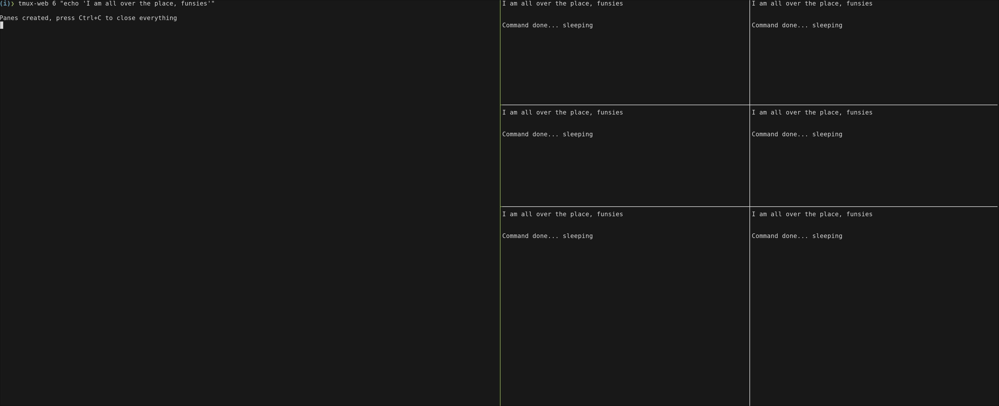

# tmux-web

Tmux script to open several panes, run a command in them all and synchronizing the exit.

```sh
tmux-web - Open and run a command in multiple tmux panes

Usage: tmux-web <NB_PANES> [COMMAND_TO_RUN]
```


